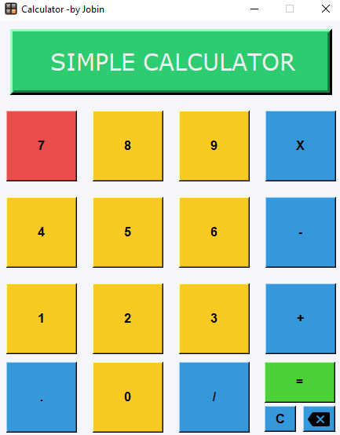

# Simple Calculator
I got an task from the [CrossRoads Team](https://www.youtube.com/c/Crossroadstalk) to build an calculator,
while the python Programing Challenge. From an Programmers mind I accepted the challenge
with hope, After start doing things gone worst but at last I completed.  
<b>Status:</b> Developing for more features. 
<b>Stable Version:</b> Version available in this  repository is stable.  

<b>Latest update feature: </b>In the old version their was a problem that When User inputs more character it will get out of the screen. 
In this update I added an if statement under the [btn_clicked](#btn_clicked) funtion to excecute and check the length everytime user inputs. When the 
display gets 11 character the charcter shows by two lines. When it gets 22 display gets full of character and decrease the character length and get upto 90 
character. 

<b>Special Credits: </b>[CrossRoads Team](https://www.youtube.com/c/Crossroadstalk) and [@AswinAsok](https://github.com/AswinAsok) (Hillarious Coder) 
<b>Author:</b> Jobin S 
<b>Mail:</b> [jobins9633@gmail.com](mailto:jobins9633@gmail.com)

# Tkinter Calculator

This is an calculator fully coded by me with  Python.
Here I am using Tkinter GUI (Graphical User Interface)

# How is it working ?

<b>note:</b> There are many methods to do this work But here I am using my own logic and more 
ideas that I got from researches.
  
In the interface I created Buttons and Label (for display) for user to interact
for the calculations. We pass argument to the btn_clicked function.

### btn_clicked()

When an argument passes to this function it takes the latest string on the value variable and 
concatenate the argument number with it. And set the value variable to the label (Display).
The mathematical operator showing on the screen while clicking it's button also uses this function
But, instead of passing argument as numbers pass string (*,/,+ and -) for the apt operators use.

## How calculations  are doing ?

When we Entering calculations the Mathematical Calculation are stored in the value variable and 
shows on the label.When the user puts the calculations and enter equal button it calls the equal_btn function. 

### equal_btn()

This function does'nt have any argument. When calling this function the mathematical problem containing
variable passes to the build in [eval function](https://www.programiz.com/python-programming/methods/built-in/eval)
and it return the answer of the Mathematical Problem then the answer is assigned to the answer variable then it is 
setting to the label (Display). After these the value is set to none for avoiding concatenate with new mathematical problem.

### clear_btn()

This function clear all operations on label. The function assign value to none and set it to the label.

### backspace_btn() 

This function backspace the operations that shows in the label

### Hover Effect

Hover effect in the button is done by the enter and leave event. Here is the [Reference](https://stackoverflow.com/questions/49888623/tkinter-hovering-over-button-color-change)
